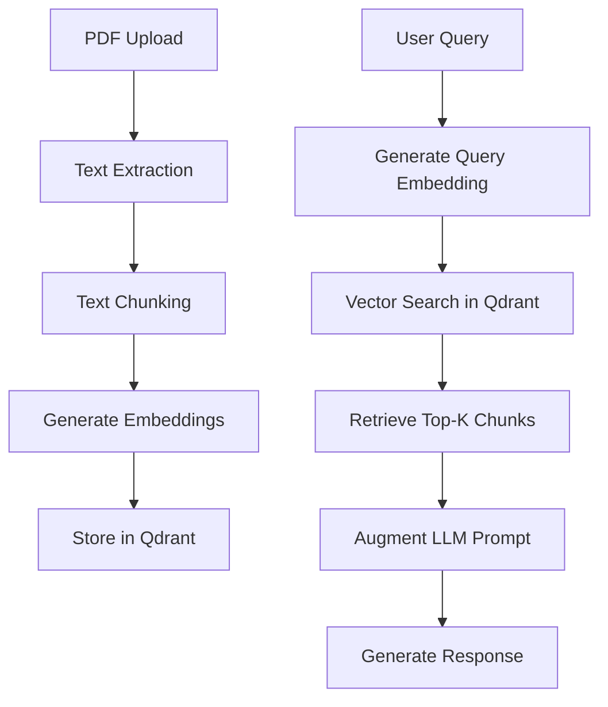
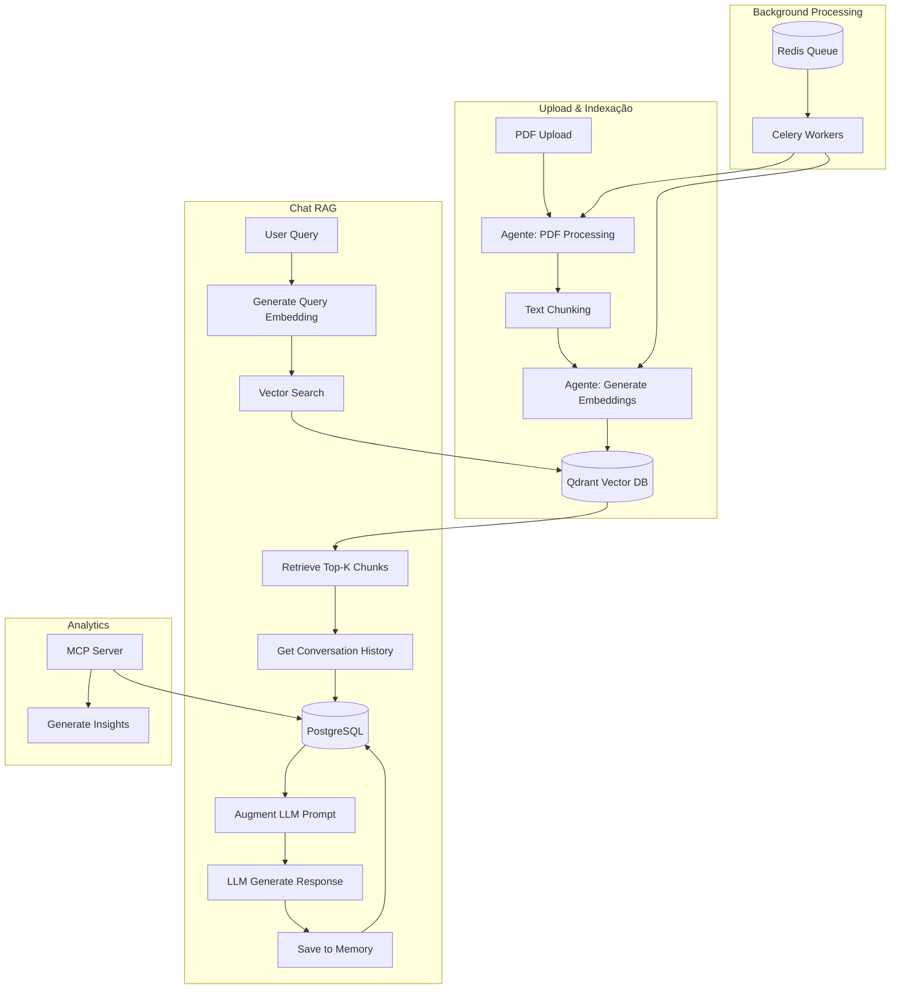

# Workshop: Desenvolvimento de Agentes Inteligentes com Python e OpenAI
## Guia Prático - Sistema Library AI

### 🎯 Objetivo do Workshop
Este guia apresenta uma implementação prática completa de um sistema de biblioteca digital inteligente, demonstrando como integrar **LLM**, **Agentes**, **MCP**, **RAG** e **Memória das Conversas** em uma aplicação real.

### 📚 O que Vamos Construir
Um sistema de biblioteca digital que permite:
- Upload e processamento de PDFs
- Chat inteligente com contexto dos livros (RAG)
- Processamento assíncrono com agentes
- Análise de dados via MCP
- Memória persistente de conversas

---

## � Módulo 1: LLM (Large Language Model)

### Conceitos Fundamentais
**LLM** é o coração do sistema, responsável por:
- Compreensão de linguagem natural
- Geração de respostas contextuais
- Interpretação de consultas complexas
- Síntese de informações

### Implementação no Sistema
O sistema utiliza **OpenAI GPT** como modelo de linguagem principal através da API da OpenAI.

### Localização dos Arquivos:
- **`api/library_backend/services/openai_service.py`** - Serviço principal do LLM

#### 🛠️ Arquitetura LLM
```python
# Configuração do Cliente OpenAI
class OpenAIService:
    def __init__(self):
        self.client = OpenAI(api_key=OPENAI_API_KEY)
        self.chat_model = "gpt-4o-mini"  # Modelo principal
        self.embedding_model = "text-embedding-ada-002"  # Para embeddings
```

#### 🔄 Fluxos de Uso

**1. Chat Simples (Sem Contexto)**
```python
async def chat(self, message: str) -> str:
    response = self.client.chat.completions.create(
        model=self.chat_model,
        messages=[
            {"role": "system", "content": "Você é uma assistente virtual útil e amigável."},
            {"role": "user", "content": message}
        ],
        max_tokens=1000,
        temperature=0.7
    )
```

**2. Chat com Contexto RAG** ⭐
```python
async def chat_with_context(self, messages: List[Dict], context_chunks: List[Dict]) -> str:
    # 🔍 Constrói contexto a partir dos chunks dos livros
    context_text = ""
    for chunk in context_chunks:
        context_text += f"\n--- Trecho do livro '{chunk['book_title']}' (Página {chunk['page_number']}) ---\n"
        context_text += chunk['text']
    
    # 🎯 Prompt especializado como bibliotecária virtual
    system_message = f"""Você é uma bibliotecária virtual especializada em ajudar usuários.

CONTEXTO DOS LIVROS:
{context_text}

INSTRUÇÕES:
1. Use APENAS as informações fornecidas no contexto
2. Cite os livros específicos quando relevante
3. Seja conversacional e útil
"""
```

**3. Geração de Embeddings**
```python
async def generate_embedding(self, text: str) -> List[float]:
    response = self.client.embeddings.create(
        input=text,
        model=self.embedding_model
    )
    return response.data[0].embedding
```

### 💡 Pontos de Aprendizado
- **Modelo**: GPT-4o-mini (principal) + text-embedding-ada-002 (embeddings)
- **Papel**: Bibliotecária virtual especializada
- **Temperatura**: 0.7 (balanceando criatividade e precisão)
- **Max Tokens**: 1000 (para manter respostas concisas)

---

## 🤖 Módulo 2: Agentes Inteligentes

### Conceitos Fundamentais
**Agentes** são entidades autônomas que executam tarefas específicas:
- Executam processamento em background
- Monitoram progresso em tempo real
- São resilientes a falhas
- Podem ser escalados horizontalmente

### Implementação com Celery
#### 🏗️ Arquitetura dos Agentes
```python
# Configuração do Celery
celery_app = Celery(
    "library_backend",
    broker=redis_url,
    backend=redis_url,
    include=[
        "library_backend.tasks.embeddings_tasks",
        "library_backend.tasks.demo_tasks"
    ]
)
```

#### 🔄 Agentes Implementados

**1. Agente de Processamento de PDF** 🔄
```python
@celery_app.task(bind=True)
def process_pdf_embeddings(self, book_id: int, text_chunks: List[str]):
    """
    Processa embeddings de forma assíncrona
    - Conecta ao Qdrant
    - Gera embeddings em lotes
    - Atualiza progresso em tempo real
    - Armazena vetores com metadata
    """
    for i, chunk in enumerate(text_chunks):
        # Gera embedding
        embedding = openai_client.embeddings.create(input=chunk)
        
        # Armazena no Qdrant
        point = PointStruct(
            id=str(uuid.uuid4()),
            vector=embedding.data[0].embedding,
            payload={
                "book_id": book_id,
                "chunk_index": i,
                "text": chunk
            }
        )
        
        # Atualiza progresso
        self.update_state(
            state='PROGRESS',
            meta={'current': i+1, 'total': len(text_chunks)}
        )
```

**2. Agente de Busca Semântica** 🔍
```python
@celery_app.task(bind=True)
def search_similar_documents(self, query: str, limit: int = 5):
    """
    Busca documentos similares usando embeddings
    - Gera embedding da query
    - Busca no Qdrant por similaridade
    - Retorna resultados rankeados
    """
```

**3. Agente de Limpeza** 🧹
```python
@celery_app.task
def cleanup_book_embeddings(book_id: int):
    """Remove embeddings de livros deletados"""
```

### 💡 Benefícios dos Agentes
- **Não-bloqueante**: API responde imediatamente
- **Monitoramento**: Progresso em tempo real
- **Escalabilidade**: Múltiplos workers
- **Resiliência**: Retry automático

---

## 🔌 Módulo 3: MCP (Model Context Protocol)

### Conceitos Fundamentais
**MCP** é um protocolo que permite:
- Exposição de ferramentas para modelos de IA
- Interação estruturada com sistemas externos
- Análise de dados em tempo real
- Integração com diferentes LLMs

### Implementação FastMCP
#### 🏗️ Servidor MCP
```python
from mcp.server.fastmcp import FastMCP

mcp = FastMCP("LibraryAnalyst")

@mcp.tool()
def get_library_stats(request: AnalysisRequest) -> Dict[str, Any]:
    """Fornece estatísticas gerais da biblioteca digital"""
    # Conecta ao PostgreSQL
    # Analisa métricas de uso
    # Retorna insights estruturados
```

#### 🛠️ Ferramentas Disponíveis

**1. Estatísticas da Biblioteca** 📊
- Total de livros e usuários ativos
- Conversas recentes
- Livros mais populares

**2. Busca de Livros por Conteúdo** 🔍
- Busca por título, autor, gênero
- Busca semântica no conteúdo
- Análise de relevância

**3. Análise de Comportamento** 👤
- Padrões de leitura do usuário
- Livros favoritos
- Temas de interesse

**4. Tópicos Populares** 📈
- Gêneros mais consultados
- Tendências de uso
- Engajamento por período

**5. Insights para Recomendações** 🎯
- Preferências identificadas
- Livros similares não lidos
- Autores para explorar

### 💡 Benefícios do MCP
- **Protocolo Padrão**: Compatível com múltiplos LLMs
- **Deployment Independente**: Container Docker isolado
- **Análise em Tempo Real**: Conexão direta com PostgreSQL

---

## 🔍 Módulo 4: RAG (Retrieval-Augmented Generation) ⭐

### Conceitos Fundamentais
**RAG** combina busca de informações com geração de texto:

1. **Retrieval**: Busca informações relevantes em uma base de conhecimento
2. **Augmentation**: Enriquece o prompt com informações encontradas  
3. **Generation**: LLM gera resposta usando o contexto aumentado

### 🏗️ Arquitetura RAG Completa



### 📋 Implementação Detalhada

#### 🔄 Fase 1: Indexação (Offline)

**1. Processamento de PDF** 📄
```python
# pdf_service.py
def create_text_chunks(self, text: str, chunk_size: int = 1000, overlap: int = 100):
    """
    Estratégia de Chunking:
    - Divide texto em chunks sobrepostos
    - Preserva contexto entre chunks
    - Quebra em frases quando possível
    """
    chunks = []
    start = 0
    
    while start < len(text):
        end = start + chunk_size
        
        # Tenta quebrar em pontuação ou espaço
        if end < len(text):
            for i in range(end, max(start + chunk_size - 200, start), -1):
                if text[i] in ['\n', '.', '!', '?']:
                    end = i + 1
                    break
                elif text[i] == ' ':
                    end = i
                    break
        
        chunk = text[start:end].strip()
        if chunk:
            chunks.append(chunk)
        
        start = max(start + 1, end - overlap)
    
    return chunks
```

**2. Geração de Embeddings** 🧮
```python
# embeddings_tasks.py
@celery_app.task(bind=True)
def process_pdf_embeddings(self, book_id: int, text_chunks: List[str]):
    """
    Processa embeddings em lotes:
    - Conecta ao Qdrant
    - Processa em batches de 5
    - Monitora progresso
    - Armazena com metadata rica
    """
    
    for i in range(0, len(text_chunks), batch_size):
        batch = text_chunks[i:i + batch_size]
        
        for chunk_idx, chunk in enumerate(batch):
            # Gera embedding
            response = openai_client.embeddings.create(
                input=chunk,
                model="text-embedding-ada-002"
            )
            
            # Cria point para Qdrant
            point = PointStruct(
                id=str(uuid.uuid4()),
                vector=response.data[0].embedding,
                payload={
                    "book_id": book_id,
                    "chunk_index": i + chunk_idx,
                    "text": chunk,
                    "chunk_size": len(chunk),
                    "book_title": book_title,
                    "page_number": page_number
                }
            )
            
            # Atualiza progresso
            self.update_state(
                state='PROGRESS',
                meta={'current': processed, 'total': len(text_chunks)}
            )
```

**3. Armazenamento Vetorial** 🗃️
```python
# qdrant_service.py
class QdrantService:
    def __init__(self):
        self.client = QdrantClient(url=qdrant_url)
        self.collection_name = "library_books"
        
    async def add_book_chunk(self, chunk_id: str, text: str, 
                           embedding: List[float], metadata: Dict):
        """
        Armazena chunk com metadata rica:
        - ID único do chunk
        - Vetor de 1536 dimensões
        - Metadata: livro, página, índice
        """
        point = PointStruct(
            id=chunk_id,
            vector=embedding,
            payload={
                "text": text,
                "book_id": metadata.get("book_id"),
                "book_title": metadata.get("book_title"),
                "chunk_index": metadata.get("chunk_index"),
                "page_number": metadata.get("page_number"),
            }
        )
        
        self.client.upsert(collection_name=self.collection_name, points=[point])
```

#### 🔎 Fase 2: Retrieval (Online)

**1. Busca Semântica** 🎯
```python
async def search_similar_chunks(self, query_embedding: List[float], 
                               book_ids: Optional[List[int]] = None, 
                               limit: int = 5):
    """
    Busca por similaridade coseno:
    - Query embedding vs todos os chunks
    - Filtro opcional por livros específicos
    - Top-K mais similares
    - Scores de similaridade
    """
    
    # Filtro opcional por livros
    query_filter = None
    if book_ids:
        query_filter = Filter(
            must=[
                FieldCondition(key="book_id", match=MatchValue(value=book_id))
                for book_id in book_ids
            ]
        )
    
    search_result = self.client.search(
        collection_name=self.collection_name,
        query_vector=query_embedding,
        query_filter=query_filter,
        limit=limit,
        with_payload=True
    )
    
    # Formata resultados com metadata
    results = []
    for hit in search_result:
        results.append({
            "id": hit.id,
            "score": hit.score,  # Similaridade coseno
            "text": hit.payload.get("text"),
            "book_id": hit.payload.get("book_id"),
            "book_title": hit.payload.get("book_title"),
            "page_number": hit.payload.get("page_number"),
        })
    
    return results
```

#### 🔗 Fase 3: Augmentation + Generation

**1. Fluxo Completo no Chat** 💬
```python
# routes/chat.py - send_message()
@router.post("/conversations/{conversation_id}/messages")
async def send_message(conversation_id: int, message_data: MessageCreate):
    """
    Fluxo RAG Completo:
    1. Salva mensagem do usuário
    2. Gera embedding da pergunta  
    3. Busca chunks relevantes no Qdrant
    4. Obtém histórico da conversa
    5. Constrói prompt aumentado
    6. Gera resposta com LLM
    7. Salva resposta e referências
    """
    
    # 1. Salvar mensagem do usuário
    user_message = Message(
        conversation_id=conversation_id,
        role="user", 
        content=message_data.content
    )
    db.add(user_message)
    
    # 2. Gerar embedding da pergunta
    query_embedding = await openai_service.generate_embedding(message_data.content)
    
    # 3. Buscar chunks relevantes no Qdrant
    relevant_chunks = await qdrant_service.search_similar_chunks(
        query_embedding=query_embedding,
        limit=5
    )
    
    # 4. Obter histórico da conversa (últimas 10 mensagens)
    previous_messages = db.query(Message).filter(
        Message.conversation_id == conversation_id
    ).order_by(Message.created_at.asc()).limit(10).all()
    
    # 5. Construir contexto para LLM
    chat_messages = []
    for msg in previous_messages:
        chat_messages.append({
            "role": msg.role,
            "content": msg.content
        })
    chat_messages.append({
        "role": "user", 
        "content": message_data.content
    })
    
    # 6. Gerar resposta com contexto RAG
    ai_response = await openai_service.chat_with_context(
        messages=chat_messages,
        context_chunks=relevant_chunks
    )
    
    # 7. Salvar resposta com livros referenciados
    books_referenced = [chunk.get('book_id') for chunk in relevant_chunks]
    ai_message = Message(
        conversation_id=conversation_id,
        role="assistant",
        content=ai_response,
        books_referenced=books_referenced
    )
    db.add(ai_message)
```

### 📊 Métricas do RAG

- **Vector DB**: Qdrant com dimensão 1536
- **Embeddings**: text-embedding-ada-002 (OpenAI)
- **Chunk Size**: 1000 caracteres com overlap de 100
- **Top-K**: 5 chunks mais similares por query
- **Similaridade**: Distância coseno
- **Metadata**: Livro, página, índice preservados

### 🎯 Vantagens da Implementação

1. **Precisão**: Chunks com overlap preservam contexto
2. **Escalabilidade**: Qdrant suporta milhões de vetores
3. **Flexibilidade**: Filtros por livro/usuário
4. **Rastreabilidade**: Citações com livro e página
5. **Performance**: Busca vetorial sub-segundo

---

## 💾 Módulo 5: Memória das Conversas
### Conceitos Fundamentais
**Memória** permite continuidade e contexto nas conversas:
- Histórico persistente de interações
- Rastreamento de referências a livros
- Análise de padrões de uso
- Personalização da experiência

### 🏗️ Estrutura de Dados

#### 📊 Modelo Relacional
```python
class Conversation(Base):
    __tablename__ = "conversations"
    
    id = Column(Integer, primary_key=True)
    user_id = Column(Integer, ForeignKey("users.id"), nullable=False)
    title = Column(String(255))  # Título da conversa
    created_at = Column(DateTime, default=datetime.utcnow)
    updated_at = Column(DateTime, default=datetime.utcnow, onupdate=datetime.utcnow)
    
    # Relacionamentos
    messages = relationship("Message", back_populates="conversation", cascade="all, delete-orphan")

class Message(Base):
    __tablename__ = "messages"
    
    id = Column(Integer, primary_key=True)
    conversation_id = Column(Integer, ForeignKey("conversations.id"), nullable=False)
    role = Column(String(20), nullable=False)  # 'user', 'assistant', 'system'
    content = Column(Text, nullable=False)
    books_referenced = Column(ARRAY(Integer))  # 🎯 Livros citados na resposta
    created_at = Column(DateTime, default=datetime.utcnow)

class UserBookInteraction(Base):
    __tablename__ = "user_book_interactions"
    
    user_id = Column(Integer, ForeignKey("users.id"), nullable=False)
    book_id = Column(Integer, ForeignKey("books.id"), nullable=False)
    interaction_type = Column(String(50), nullable=False)  # 'chat_reference'
    metadata_info = Column(JSON)  # Contexto da interação
    created_at = Column(DateTime, default=datetime.utcnow)
```

#### 🔄 Gestão de Conversas
```python
# Criar nova conversa
@router.post("/conversations")
async def create_conversation(conversation_data: ConversationCreate):
    conversation = Conversation(
        user_id=current_user.id,
        title=conversation_data.title
    )
    db.add(conversation)
    return conversation

# Obter conversa com histórico completo
@router.get("/conversations/{conversation_id}")
async def get_conversation(conversation_id: int):
    conversation = db.query(Conversation).filter(
        Conversation.id == conversation_id,
        Conversation.user_id == current_user.id
    ).first()
    
    messages = db.query(Message).filter(
        Message.conversation_id == conversation_id
    ).order_by(Message.created_at.asc()).all()
    
    return ConversationWithMessages(
        **conversation.__dict__,
        messages=[MessageResponse(**msg.__dict__) for msg in messages]
    )
```

#### 🧠 Contexto nas Respostas
```python
# No chat RAG - send_message()
# Obtém histórico (últimas 10 mensagens) para contexto
previous_messages = db.query(Message).filter(
    Message.conversation_id == conversation_id
).order_by(Message.created_at.asc()).limit(10).all()

# Constrói contexto para o LLM
chat_messages = []
for msg in previous_messages:
    chat_messages.append({
        "role": msg.role,
        "content": msg.content
    })

# O LLM recebe tanto o histórico quanto o contexto RAG
ai_response = await openai_service.chat_with_context(
    messages=chat_messages,  # 🧠 Memória da conversa
    context_chunks=relevant_chunks  # 🔍 Contexto RAG
)
```

### 📈 Rastreamento de Interações
```python
# Registra quais livros foram referenciados
for book_id in books_referenced:
    interaction = UserBookInteraction(
        user_id=current_user.id,
        book_id=book_id,
        interaction_type="chat_reference",
        metadata_info={
            "conversation_id": conversation_id,
            "message_id": ai_message.id,
            "query": message_data.content
        }
    )
    db.add(interaction)
```

### 💡 Benefícios da Memória
- **Contexto Contínuo**: Conversas fluidas e naturais
- **Rastreabilidade**: Histórico completo de interações
- **Personalização**: Análise de preferências do usuário
- **Analytics**: Insights sobre uso e engajamento

---

## 🏗️ Arquitetura Integrada

### 🔄 Fluxo de Dados Completo



### 🎯 Componentes Integrados

| Componente | Tecnologia | Função |
|-----------|------------|---------|
| **LLM** | OpenAI GPT-4o-mini | Geração de respostas contextuais |
| **Embeddings** | text-embedding-ada-002 | Representação semântica |
| **Vector DB** | Qdrant | Busca por similaridade |
| **Memory** | PostgreSQL | Persistência de conversas |
| **Agents** | Celery + Redis | Processamento assíncrono |
| **MCP** | FastMCP | Ferramentas analíticas |

### 🚀 Pipeline de Processamento

1. **Indexação** (Offline)
   - Upload PDF → Extração → Chunking → Embeddings → Qdrant

2. **Chat RAG** (Online) 
   - Query → Embedding → Search → Context → LLM → Response → Memory

3. **Analytics** (Sob demanda)
   - MCP Tools → PostgreSQL → Insights → Dashboard

### 💡 Pontos de Aprendizado Avançados

#### 🎯 Otimizações RAG
- **Chunk Strategy**: Overlap para preservar contexto
- **Embedding Cache**: Evita reprocessamento
- **Filtros Dinâmicos**: Busca por usuário/livro específico
- **Reranking**: Melhora relevância dos resultados

#### 🔄 Escalabilidade
- **Horizontal**: Múltiplos workers Celery
- **Vertical**: Qdrant distributed clusters
- **Caching**: Redis para embeddings frequentes
- **Load Balancing**: API Gateway para distribuição

#### 🛡️ Monitoramento
- **Métricas**: Latência, throughput, accuracy
- **Logging**: Structured logs com contexto
- **Alerting**: Falhas de embedding ou busca
- **Analytics**: Padrões de uso via MCP

---

## 🎓 Conclusão do Workshop

### ✅ O que Aprendemos

1. **LLM Integration**: Como integrar OpenAI em sistemas reais
2. **RAG Implementation**: Pipeline completo de Retrieval-Augmented Generation
3. **Async Agents**: Processamento background com Celery
4. **MCP Protocol**: Exposição de ferramentas para IA
5. **Memory Systems**: Persistência inteligente de conversas

### 🏆 Arquitetura Completa Construída

✅ **LLM**: OpenAI GPT-4o-mini como cérebro principal  
✅ **Agentes**: Celery tasks para processamento assíncrono  
✅ **MCP**: Servidor de ferramentas analíticas  
✅ **RAG**: Qdrant + OpenAI embeddings para busca semântica  
✅ **Memória**: PostgreSQL para persistência de conversas  

### 🚀 Próximos Passos

1. **Deployment**: Docker Compose para produção
2. **Monitoring**: Prometheus + Grafana
3. **Security**: Autenticação e autorização
4. **Performance**: Otimizações de cache e índices
5. **Features**: Recomendações personalizadas

### 📚 Stack Tecnológica Final

- **Backend**: FastAPI + SQLAlchemy + PostgreSQL
- **AI/ML**: OpenAI API + Qdrant Vector DB
- **Async**: Celery + Redis
- **Protocol**: FastMCP
- **Deploy**: Docker + Docker Compose

### 💭 Reflexões Finais

Este sistema demonstra como integrar múltiplas tecnologias de IA de forma coesa:

- **RAG** fornece conhecimento específico e atualizado
- **Agentes** garantem processamento não-bloqueante  
- **MCP** oferece ferramentas estruturadas para análise
- **Memória** mantém contexto e personalização
- **LLM** orquestra tudo com inteligência natural

O resultado é uma aplicação que não apenas responde perguntas, mas **aprende**, **lembra** e **evolui** com o uso, demonstrando o verdadeiro potencial dos **Agentes Inteligentes** modernos.

---

*Workshop desenvolvido por: Sistema Library AI - Demonstração Prática de IA Integrada*
O sistema implementa memória persistente através de **PostgreSQL** com estrutura relacional completa.

### Localização dos Arquivos:
- **`api/library_backend/models/__init__.py`** - Modelos de dados das conversas
- **`api/library_backend/routes/chat.py`** - Endpoints de gerenciamento de conversas
- **`api/library_backend/dto/chat_dto.py`** - DTOs para comunicação
- **`init-scripts/01-init.sql`** - Schema inicial do banco

### Como a Memória Funciona:

#### 1. **Estrutura de Dados**
```python
class Conversation(Base):
    __tablename__ = "conversations"
    
    id = Column(Integer, primary_key=True)
    user_id = Column(Integer, ForeignKey("users.id"), nullable=False)
    title = Column(String(255))  # Título da conversa
    created_at = Column(DateTime, default=datetime.utcnow)
    updated_at = Column(DateTime, default=datetime.utcnow, onupdate=datetime.utcnow)
    
    messages = relationship("Message", back_populates="conversation", cascade="all, delete-orphan")

class Message(Base):
    __tablename__ = "messages"
    
    id = Column(Integer, primary_key=True)
    conversation_id = Column(Integer, ForeignKey("conversations.id"), nullable=False)
    role = Column(String(20), nullable=False)  # 'user', 'assistant', 'system'
    content = Column(Text, nullable=False)  # Conteúdo da mensagem
    books_referenced = Column(ARRAY(Integer))  # Livros referenciados na resposta
    created_at = Column(DateTime, default=datetime.utcnow)
```

#### 2. **Gestão de Conversas**
```python
# Criar nova conversa
@router.post("/conversations", response_model=ConversationResponse)
async def create_conversation(conversation_data: ConversationCreate):

# Listar conversas do usuário
@router.get("/conversations", response_model=List[ConversationResponse])
async def list_conversations():

# Obter conversa com histórico completo
@router.get("/conversations/{conversation_id}", response_model=ConversationWithMessages)
async def get_conversation(conversation_id: int):

# Deletar conversa
@router.delete("/conversations/{conversation_id}")
async def delete_conversation(conversation_id: int):
```

#### 3. **Contexto nas Respostas**
```python
# Em routes/chat.py - send_message()
# Obtém histórico da conversa (últimas 10 mensagens)
previous_messages = db.query(Message).filter(
    Message.conversation_id == conversation_id,
    Message.id != user_message.id
).order_by(Message.created_at.asc()).limit(10).all()

# Constrói contexto para o LLM
chat_messages = []
for msg in previous_messages:
    chat_messages.append({
        "role": msg.role,
        "content": msg.content
    })
```

#### 4. **Rastreamento de Interações**
```python
class UserBookInteraction(Base):
    __tablename__ = "user_book_interactions"
    
    user_id = Column(Integer, ForeignKey("users.id"), nullable=False)
    book_id = Column(Integer, ForeignKey("books.id"), nullable=False)
    interaction_type = Column(String(50), nullable=False)  # 'chat_reference'
    metadata_info = Column(JSON)  # Dados da interação
    created_at = Column(DateTime, default=datetime.utcnow)
```

### Características da Memória:
- **Persistência**: PostgreSQL com relacionamentos
- **Contexto**: Últimas 10 mensagens incluídas no prompt
- **Rastreamento**: Livros referenciados em cada resposta
- **Histórico**: Conversas organizadas por usuário
- **Metadados**: Timestamps, referências, tipos de interação

---

## 🏗️ Arquitetura Geral

### Fluxo de Dados Completo:

1. **Upload de PDF** → **Processamento** → **Chunks** → **Embeddings** → **Qdrant**
2. **Pergunta do Usuário** → **Embedding** → **Busca RAG** → **Contexto** → **LLM** → **Resposta**
3. **Conversa** → **Memória PostgreSQL** → **Histórico** → **Contexto para próximas interações**
4. **Análises** → **MCP Server** → **Ferramentas Externas** → **Insights**

### Componentes de IA Integrados:
- ✅ **LLM**: OpenAI GPT-4o-mini como cérebro principal
- ✅ **Agentes**: Celery tasks para processamento assíncrono
- ✅ **MCP**: Servidor de ferramentas analíticas
- ✅ **RAG**: Qdrant + OpenAI embeddings para busca semântica
- ✅ **Memória**: PostgreSQL para persistência de conversas

### Tecnologias Utilizadas:
- **LLM**: OpenAI API (GPT-4o-mini + text-embedding-ada-002)
- **Vector DB**: Qdrant
- **Task Queue**: Celery + Redis
- **Database**: PostgreSQL
- **Framework**: FastAPI + SQLAlchemy
- **MCP**: FastMCP

Este sistema representa uma implementação completa de uma arquitetura de IA moderna, integrando LLM, RAG, agentes e memória persistente em uma solução coesa para biblioteca digital inteligente.